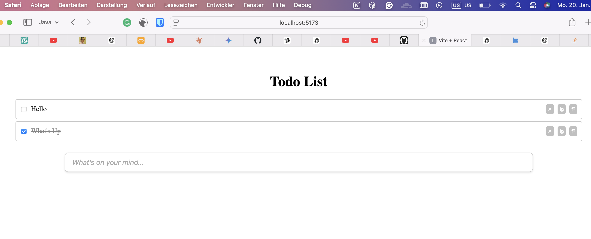

# Todo List Application

A simple and interactive Todo List application built with **React**. This project demonstrates how to create, manage, and manipulate tasks in a list with essential features like adding, removing, marking tasks as complete, and rearranging their order.

---

## Features

1. **Add Tasks**
   - Type a task into the input field and press `Enter` to add it to the list.

2. **Mark Tasks as Complete**
   - Click on a task to toggle its completion status. Completed tasks are displayed with a green background and a strikethrough effect.

3. **Remove Tasks**
   - Use the red "X" button to delete a task from the list.

4. **Reorder Tasks**
   - Move tasks up or down in the list using the arrow buttons.

5. **Interactive UI**
   - Responsive design with hover animations and a user-friendly interface.

---

## Installation

### Prerequisites
- Node.js (v14 or higher)
- npm or yarn

### Steps
1. Clone the repository:
   ```bash
   git clone https://github.com/aryala7/symmetrical-enigma
   ```

2. Navigate to the project directory:
   ```bash
   cd symmetrical-enigma
   ```

3. Install dependencies:
   ```bash
   npm install
   # or
   yarn install
   ```

4. Start the development server:
   ```bash
   npm start
   # or
   yarn start
   ```

5. Open the application in your browser at:
   ```
   http://localhost:3000
   ```

---

## Project Structure

```
.
├── src
│   ├── components
│   │   └── TodoList.js    # Main Todo List component
│   ├── styles
│   │   └── styles.css     # Styling for the application
│   ├── App.js             # Root component
│   └── index.js           # Application entry point
├── public
│   └── index.html         # Main HTML file
└── package.json           # Project metadata and dependencies
```

---

## Usage

1. **Adding a Task**:
   - Type a task in the input field and press `Enter`.

2. **Marking a Task as Complete**:
   - Click on the task to toggle its completion status.

3. **Reordering Tasks**:
   - Use the **Up** and **Down** arrow buttons to rearrange tasks.

4. **Removing a Task**:
   - Click on the **X** button to delete the task.

---

## Technologies Used

- **React**: Frontend framework
- **FontAwesome**: Icons for buttons
- **CSS**: Styling and animations

---

## Screenshots

### Main View:


---

## Contributing

1. Fork the repository.
2. Create a new branch:
   ```bash
   git checkout -b feature-new-feature
   ```
3. Make your changes and commit them:
   ```bash
   git commit -m "Add a new feature"
   ```
4. Push the changes:
   ```bash
   git push origin feature-new-feature
   ```
5. Submit a pull request.

---

## License

This project is licensed under the MIT License - see the [LICENSE](LICENSE) file for details.

---

## Acknowledgments

- Inspired by modern productivity apps.
- Special thanks to [FontAwesome](https://fontawesome.com/) for their icons.

---

Feel free to customize the application as per your needs and experiment with new features! 😊

